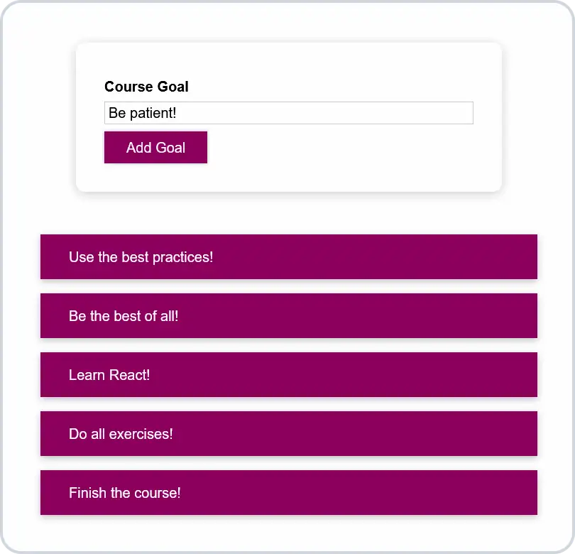

# 📜 React Goal List

**Simple course goal list made with React.**

## 💻 Screenshot

## 🛠️ Tools and technologies
`React` `CSS modules` `VS Code`

## 🌐 Deployment
Deployed on `Netlify`.

Live preview at [dawidlehai-react-goal-list.netlify.app](https://dawidlehai-react-goal-list.netlify.app/).

## 🎓 Related course
This project was created as a part of the [Udemy](https://www.udemy.com/ 'Udemy') course [_React - The Complete Guide (incl Hooks, React Router, Redux)_](https://www.udemy.com/course/react-the-complete-guide-incl-redux/ 'See this course on Udemy') by [Maximilian Schwarzmüller](https://twitter.com/maxedapps 'Maximilian Schwarzmüller on Twitter').

By preparing this project I learned how to work with CSS styles in React.
